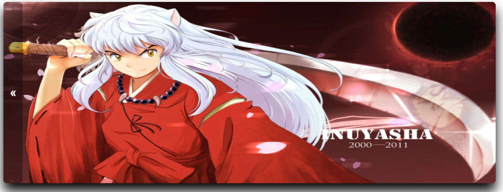

<h1 align="center">Tabuada Web</h1>

<br>
<br>
<p align="center">
  
  
     
</p>

<br>
<br>

## 🧪 Tecnologias

Esse projeto foi desenvolvido com as seguintes tecnologias:

- HTML
- CSS
- JAVASCRIPT
<br>

## 🚀 Como executar

Clone o projeto e acesse a pasta do mesmo.

```bash
$ git clone https://github.com/Hugovarellaa/Tabuada
$ cd Tabuada
```

Para iniciá-lo, siga os passos abaixo:
```bash
# Instale Live Server

# Clique com o botão direito em um arquivo HTML na janela do Explorer e clique em Abrir com Live Server

```
